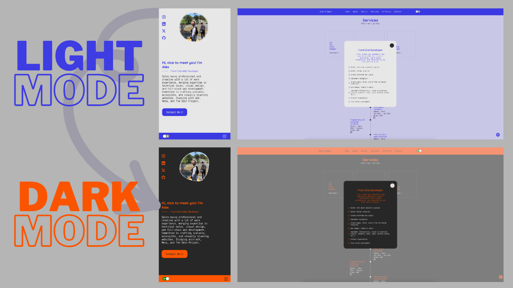

# React Portfolio

A modern, responsive portfolio website showcasing my skills and projects as a Front End Developer and UI/UX Designer.

# Screenshots

## Updated


## Old Version



## Features

-   **Responsive Design**: Fully optimised for desktop, tablet, and mobile devices
-   **Dark/Light Theme**: Toggle between dark and light modes with persistent preference storage
-   **Smooth Animations**: Polished transitions and scroll behaviors for enhanced user experience
-   **Fullscreen Navigation**: Mobile-friendly slide-in menu with overlay
-   **Interactive Modals**: Service details displayed in accessible modal dialogs
-   **Route-Based Navigation**: Multi-page structure using React Router
-   **Scroll Lock Management**: Prevents background scrolling when modals/menus are open
-   **Contact Form**: Direct communication channel for potential clients and collaborators

## Technologies Used

### Frontend

-   **React 18** - UI library with hooks and modern patterns
-   **React Router v6** - Client-side routing and navigation
-   **React Switch** - Customizable theme toggle component
-   **React Scroll** - Smooth scrolling to sections

### Styling

-   **CSS3** - Custom styling with CSS variables for theming
-   **Bootstrap Icons** - Icon library for UI elements
-   **Google Fonts** - Typography (Victor Mono, Quicksand, Mulish, DM Mono)

### Build Tools

-   **Vite** - Fast build tool and dev server
-   **HashRouter** - Hash-based routing for static hosting compatibility

## Project Structure

```
portfolio/
├── src/
│   ├── components/
│   │   ├── Header/          # Navigation and theme toggle
│   │   ├── Home/            # Hero section
│   │   ├── About/           # About me section
│   │   ├── Skills/          # Technical skills showcase
│   │   ├── Services/        # Service offerings with modals
│   │   ├── Qualification/   # Education and experience
│   │   ├── Testimonials/    # Client testimonials
│   │   ├── Contact/         # Contact form
│   │   ├── Footer/          # Footer with links
│   │   └── BackToTop/       # Scroll to top button
│   ├── pages/
│   │   └── Portfolio/       # Portfolio projects page
│   ├── App.jsx              # Main app component with routing
│   ├── App.css              # Global styles and variables
│   └── main.jsx             # Application entry point
├── public/                  # Static assets
└── package.json
```

## Key Components

### Services Modal

Features a custom modal implementation with:

-   Scroll position preservation on open/close
-   Smooth scroll behavior disabled during transitions
-   Fixed body positioning to prevent background scroll
-   Accessible close buttons and overlay clicks

### Theme System

-   Context-based theme management
-   localStorage persistence
-   Dynamic CSS variables for seamless transitions
-   Safari-specific fixes for theme color meta tags

### Navigation

-   Sticky header with responsive behavior
-   Fullscreen mobile menu with slide-in animation
-   Conditional scroll links based on current route
-   Automatic menu close on navigation

## Performance Optimizations

-   Lazy loading for route components
-   Optimized font loading with `font-display: swap`
-   Image optimization and lazy loading
-   Code splitting by route
-   Efficient scroll lock implementation
-   Minimized CSS and JavaScript bundles

## Browser Support

-   Chrome (latest)
-   Firefox (latest)
-   Safari (latest)
-   Edge (latest)
-   Mobile browsers (iOS Safari, Chrome Mobile)

## Known Issues & Fixes

### iOS Safari (Apple Glass UI)

-   Fixed status bar color matching
-   Touch scrolling optimisation in modals
-   Viewport height fixes using `dvh` units

## License

MIT License

Copyright (c) 2025 Alex Grigore agworksbox@gmail.com

Permission is hereby granted, free of charge, to any person obtaining a copy of this software and associated documentation files (the "Software"), to deal in the Software without restriction, including without limitation the rights to use, copy, modify, merge, publish, distribute, sublicense, and/or sell copies of the Software, and to permit persons to whom the Software is furnished to do so, subject to the following conditions:

The above copyright notice and this permission notice shall be included in all copies or substantial portions of the Software.

THE SOFTWARE IS PROVIDED "AS IS", WITHOUT WARRANTY OF ANY KIND, EXPRESS OR IMPLIED, INCLUDING BUT NOT LIMITED TO THE WARRANTIES OF MERCHANTABILITY, FITNESS FOR A PARTICULAR PURPOSE AND NONINFRINGMENT. IN NO EVENT SHALL THE AUTHORS OR COPYRIGHT HOLDERS BE LIABLE FOR ANY CLAIM, DAMAGES OR OTHER LIABILITY, WHETHER IN AN ACTION OF CONTRACT, TORT OR OTHERWISE, ARISING FROM, OUT OF OR IN CONNECTION WITH THE SOFTWARE OR THE USE OR OTHER DEALINGS IN THE SOFTWARE.

## Badges


[](https://app.netlify.com/sites/alex-grigore/deploys)
